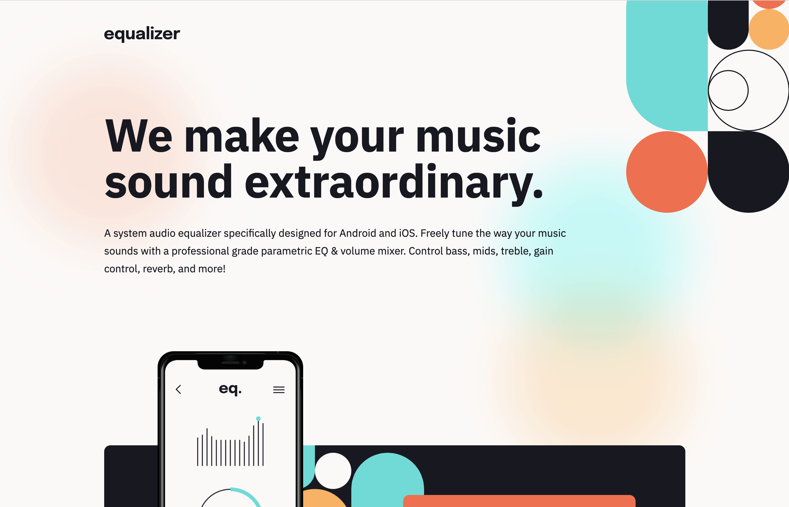

# Frontend Mentor - Equalizer landing page solution

This is a solution to the [Equalizer landing page challenge on Frontend Mentor](https://www.frontendmentor.io/challenges/equalizer-landing-page-7VJ4gp3DE). Frontend Mentor challenges help you improve your coding skills by building realistic projects.

## Table of contents

- [Overview](#overview)
  - [The challenge](#the-challenge)
  - [Screenshot](#screenshot)
  - [Links](#links)
- [My process](#my-process)
  - [Built with](#built-with)
  - [What I learned](#what-i-learned)
- [Author](#author)

## Overview

### The challenge

Users should be able to:

- View the optimal layout depending on their device's screen size
- See hover states for interactive elements

### Screenshot



### Links

- Live Site URL: [https://bqshina.github.io/My-Portfolio/projects/equalizer-landing-page/index.html](https://bqshina.github.io/My-Portfolio/projects/equalizer-landing-page/index.html)

## My process

### Built with

- Semantic HTML5 markup
- CSS custom properties
- CSS flex

### What I learned

How to apply multiple background by css to make a better ground

```css
body {
  background: url(assets/bg-pattern-1.svg) 100% -3.5% no-repeat, var(--white) url(assets/bg-main-desktop.png)
      top center no-repeat;
  background-size: auto, cover;
}
```

## Author

- Website - [Shina Qin](https://bqshina.github.io/My-Portfolio/)
- Frontend Mentor - [@bqShina](https://www.frontendmentor.io/profile/bqShina)
- Twitter - [@xiaohan_qin](https://www.twitter.com/xiaohan_qin)
