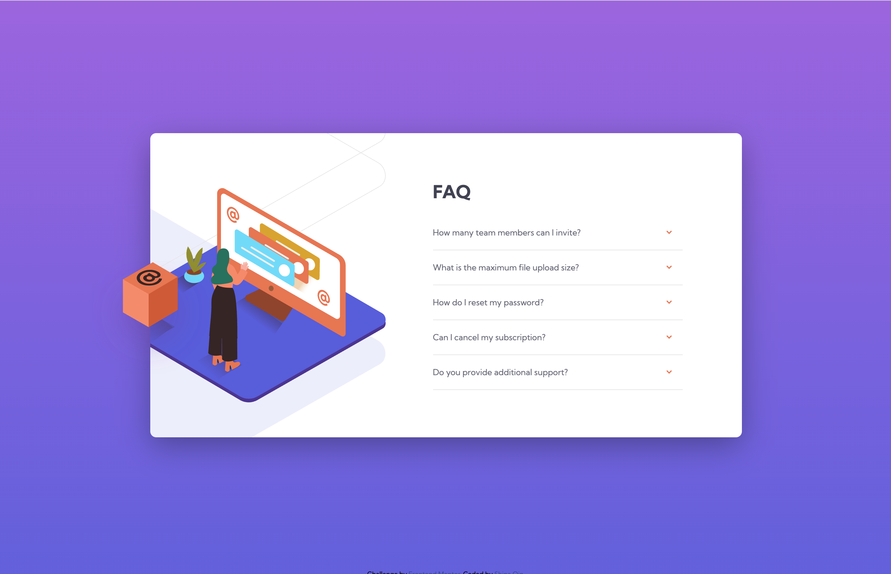

# Frontend Mentor - FAQ accordion card solution

This is a solution to the [FAQ accordion card challenge on Frontend Mentor](https://www.frontendmentor.io/challenges/faq-accordion-card-XlyjD0Oam). Frontend Mentor challenges help you improve your coding skills by building realistic projects.

## Table of contents

- [Overview](#overview)
  - [The challenge](#the-challenge)
  - [Screenshot](#screenshot)
  - [Links](#links)
- [My process](#my-process)
  - [Built with](#built-with)
  - [What I learned](#what-i-learned)
- [Author](#author)

## Overview

### The challenge

Users should be able to:

- View the optimal layout for the component depending on their device's screen size
- See hover states for all interactive elements on the page
- Hide/Show the answer to a question when the question is clicked

### Screenshot



### Links

- Live Site URL: [https://bqshina.github.io/My-Portfolio/projects/faq-accordion-card-main/index.html](https://bqshina.github.io/My-Portfolio/projects/faq-accordion-card-main/index.html)

## My process

### Built with

- Semantic HTML5 markup
- CSS custom properties
- CSS flex

### What I learned

Apply checkbox input to create Collapse instead of JavaScript

```html
<div class="question">
  <input type="checkbox" name="faq-btn" id="faq1" />

  <label for="faq1">
    <span>How many team members can I invite?</span>
    
  </label>
  <p>
    You can invite up to 2 additional users on the Free plan. There is no limit
    on team members for the Premium plan.
  </p>
</div>
```

```css
input[type="checkbox"] ~ p {
  display: none;
  line-height: 1.5;
  font-size: 12px;
}

input[type="checkbox"]:checked ~ p {
  display: block;
}
```

## Author

- Website - [Shina Qin](https://bqshina.github.io/My-Portfolio/)
- Frontend Mentor - [@bqShina](https://www.frontendmentor.io/profile/bqShina)
- Twitter - [@xiaohan_qin](https://www.twitter.com/xiaohan_qin)
